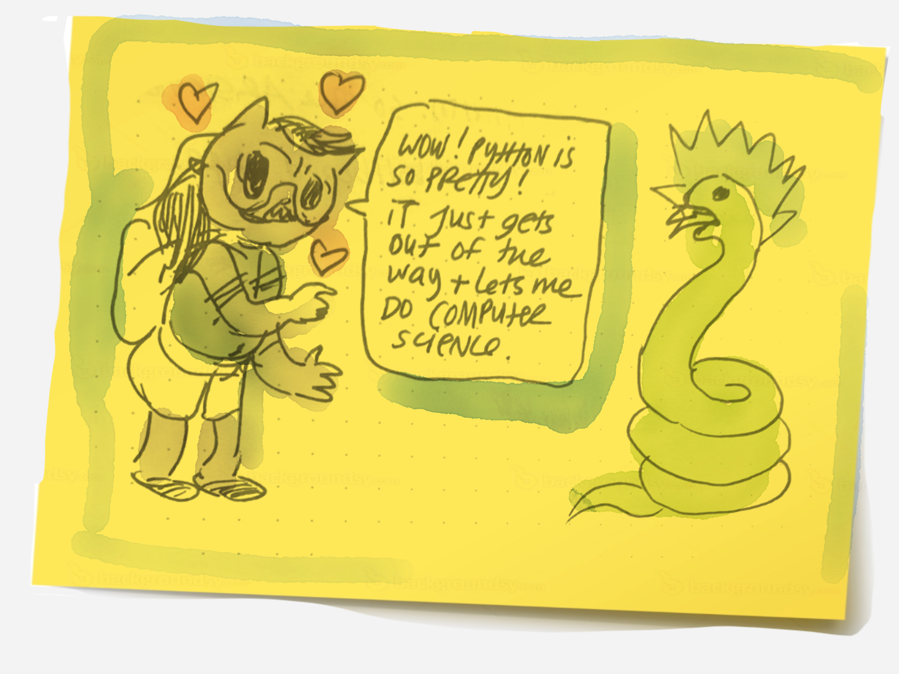

# SELF HELP LEARNING PYTHON GUIDE

## Intro
I've tried several times over the years to learn Python and have failed, mostly due to a lack of focus and bad study techniques.

Learning is totally possible outside of a formal classroom. 

Most course materials are free, and if you live in the Bay Area there are so many great people willing to help you. I'm lucky enough to have face-to-face learning opportunities [learning Python at the Noisebridge hackerspace from passionate folks](https://www.noisebridge.net/wiki/PyClass)!

My biggest takeway was that __people are human__ and computers are designed to be _super distracting_.

## Chapters

* Chapter 1: Acknowledge you're human